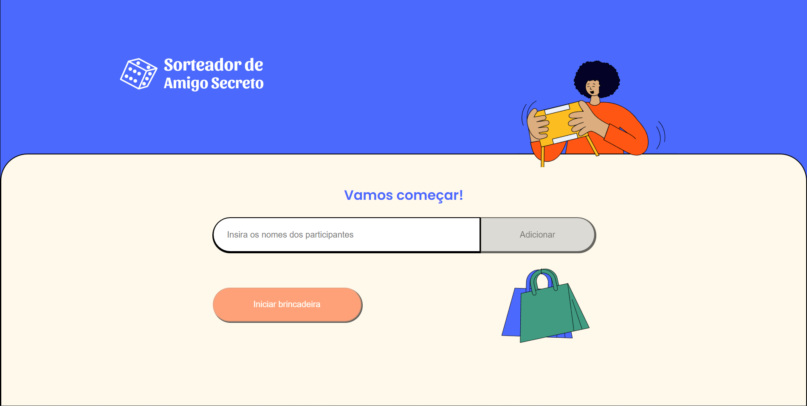

# marvel-comics

<h4 align="center">
  Sorteador de Amigo Secreto
</h4>

  <a href="#-tecnologias">Tecnologias</a>&nbsp;&nbsp;&nbsp;|&nbsp;&nbsp;&nbsp;
  <a href="#-projeto">Projeto</a>&nbsp;&nbsp;&nbsp;|&nbsp;&nbsp;&nbsp;
  <a href="#-layout">Configuração</a>

 

  

## : Tecnologias

Esse projeto foi desenvolvido com as seguintes tecnologias:

- [React](https://reactjs.org)
- [Jest](https://styled-components.com/](https://jestjs.io/pt-BR/))
- [Testing Library](https://reactcommunity.org/react-modal/](https://testing-library.com/))

## 💻 Projeto

O projeto é um sistema Sorteador de Amigo Secreto feito em React, e foi desenvolvid com TDD. O projeto teve como objetivo:
- Implementar testes que garantem o comportamento dos componentes
- Utilizar o Jest para realizar asserções
- Estudar a técnica TDD

## ⚙ Configuração

1- Antes de começar, você vai precisar instalar na sua máquina as seguintes ferramentas: Git, Node. Além disso, é bom ter um editor para trabalhar com código, como o <a href="https://code.visualstudio.com/download">VSCode</a>.

Para instalar as dependências no front-end:
> npm install
Para iniciar a aplicação no front-end:
> npm run dev
